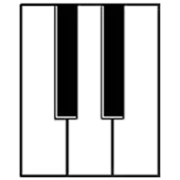

# Piano Unite

<!-- PROJECT LOGO -->
 

  

  <h3 align="center">Piano Unite</h3>

  

    Teach & Learn elemental piano!
     
    <a href="https://github.com/ErGuille33/ProjectPianoHero"><strong>Explore the docs »</strong></a>
     
    <a href="https://narratech.itch.io/piano-unite">Play Piano Unite</a>
  

<!-- ABOUT THE PROJECT -->
## About Piano Unite

Piano Unite is a tool, created by Guillermo Sánchez de Lamadrid, that enables teachers and students to work on elemental piano lessons. Teachers will be able to create customized exercises for their students, while students will learn as they play. 

Piano Unite is able to evaluate performance on each of the exercises and will reward the student's progress. In addition, you will be able to import any MIDI file to use it as a new game level.

To use this tool optimally, you must connect a MIDI keyboard to your computer.

There are two versions, one for teachers (Alumno version) and one for students (Profesor version). This application is written completely in Spanish and it is compatible with Windows 7, 10 and 11.

This tool was created as part of a bachelor thesis for the UCM (Universidad Complutense de Madrid). 

(<a href="#top">back to top</a>)

### Built With

Here we will list the tools and libraries used to develop Piano Unite.

* [Unity](https://unity.com/)
* [MidiJack](https://github.com/keijiro/MidiJack)

(<a href="#top">back to top</a>)

<!-- GETTING STARTED -->
## Sections of Interest

Inside the directory "..\Assets\PianoScene\Scripts" you can find "MidiFile.cs" and "MidiRecorder.cs". This two scripts can be reused in order to read and write MIDI files, and convert them to a series of events wich can be used in any rythm game. 

(<a href="#top">back to top</a>)

<!-- LICENSE -->
## License

 Piano Unite Copyright (C) <2022>  <>

    This program is free software: you can redistribute it and/or modify
    it under the terms of the GNU General Public License as published by
    the Free Software Foundation, either version 3 of the License, or
    (at your option) any later version.

    This program is distributed in the hope that it will be useful,
    but WITHOUT ANY WARRANTY; without even the implied warranty of
    MERCHANTABILITY or FITNESS FOR A PARTICULAR PURPOSE.  See the
    GNU General Public License for more details.

    You should have received a copy of the GNU General Public License
    along with this program.  If not, see <http://www.gnu.org/licenses/>.

(<a href="#top">back to top</a>)

<!-- CONTACT -->
## Contact

Project Link: [https://github.com/ErGuille33/ProjectPianoHero](https://github.com/ErGuille33/ProjectPianoHero)

(<a href="#top">back to top</a>)

